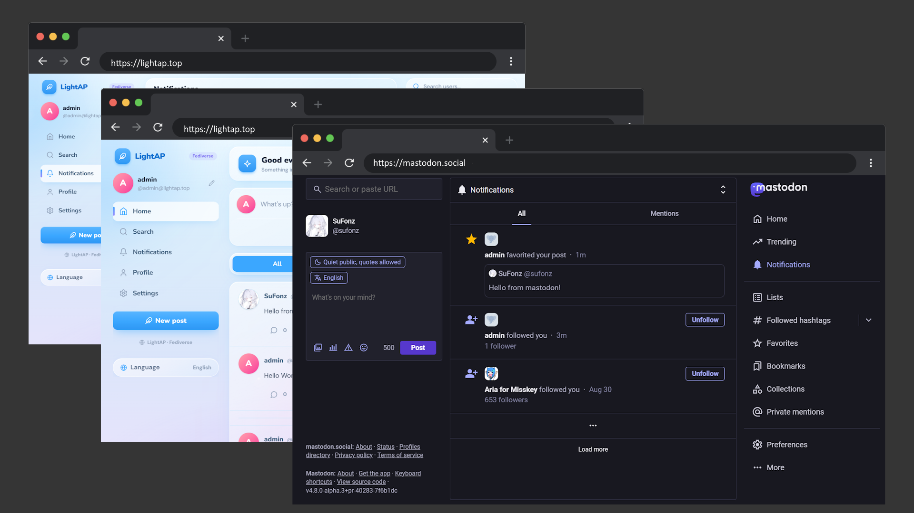

# LightAP

> [!WARNING]
> **Early stage.** LightAP is a very early-stage project that was built with the help of AI.
> Expect bugs, performance issues, and breaking changes without notice.
> Found a bug? Open an issue.

**English** | [简体中文](./README.zh-CN.md)

LightAP is a decentralized social platform built on the [ActivityPub](https://activitypub.rocks/) federation protocol. It serves standard WebFinger and Actor documents so other instances can discover users here, and every activity sent to a remote instance is signed with HTTP Signatures and delivered to that instance's inbox. You can talk to users on any instance that supports ActivityPub — be it Mastodon, Misskey, Pleroma, or another self-hosted server.

It is a serverless project: the whole app is bundled into a single Cloudflare Worker, with the frontend and backend served from the same build output and backed by D1, Durable Objects and Queues.

## Screenshots



## Features

**Federation**

- WebFinger at `/.well-known/webfinger`, Actor documents at `/users/[username]`
- Inbox at `/users/[username]/inbox` handles `Follow`, `Accept`, `Create`, `Delete`, `Like` and `Undo`
- HTTP Signatures: RFC 9421 and draft-cavage (legacy). Outgoing requests try RFC 9421 and fall back to draft-cavage; incoming requests are accepted either way
- Incoming requests are verified against the sender's public key before anything is written to the database
- `Digest` / `Content-Digest` body digests, computed with SHA-256
- Every user gets an RSA keypair (RSASSA-PKCS1-v1_5, 2048-bit) generated at registration
- Outgoing activities are delivered through a Cloudflare Queue with automatic retry; remote latency does not block requests
- `followers` and `following` are served as real ActivityPub `OrderedCollection`s
- Deleted posts answer with `410 Gone` and a `Tombstone`

**App**

- Timelines: All / Local / Following, with infinite scroll
- Post, reply, like, follow / unfollow, delete
- Notifications for Follow, Like and Reply
- Live updates over SSE: new posts, replies, likes and notifications all land without a refresh, and the client back-fills anything missed while disconnected
- Cross-instance user search with `@user@domain`
- Profile pages with post, following and follower counts
- Edit your own display name and bio; both live in the same table the Actor document is built from, so remote instances pick up the change on their next fetch
- Guests can browse the timeline and profiles without an account
- Interface in Chinese or English, switchable at runtime — the choice is remembered in a cookie and applied server-side, so the first paint is already in the right language

**Accounts**

- Register and log in with a username and password
- Passwords are hashed with PBKDF2-SHA256 (100,000 iterations, 16-byte salt)
- Sessions are a hand-rolled HS256 JWT in an HttpOnly cookie (`Secure`, `SameSite=Lax`), valid for 7 days
- Remote users are stored alongside local ones so their posts render with avatars and display names, but they cannot log in

## Tech stack

| Layer | Choice |
| --- | --- |
| Framework | [vinext](https://vinext.dev) (React Server Components, App Router) 1.0.0-beta |
| Build | Vite 8 + `@cloudflare/vite-plugin` |
| Runtime | Cloudflare Workers — one Worker with `fetch` and `queue` handlers |
| Database | Cloudflare D1 (SQLite) via Drizzle ORM |
| Real-time | Durable Objects + Server-Sent Events |
| Async delivery | Cloudflare Queues |
| Styling | Tailwind CSS v4 |
| i18n | A hand-rolled, typed dictionary (`zh` / `en`) — no i18n dependency |
| Crypto | Web Crypto only — no third-party auth or JWT dependencies |

## Project structure

```
├── app/                          # Routes (App Router)
│   ├── page.tsx                  # Timeline
│   ├── post/[uuid]/              # Thread / post detail
│   ├── u/[username]/             # Profile
│   ├── search/                   # Search
│   ├── notifications/            # Notifications
│   ├── settings/                 # Settings + about
│   └── (backend)/                # Server-only routes
│       ├── .well-known/webfinger/
│       ├── api/v1/               # JSON API
│       ├── notes/[uuid]/         # AP Note object
│       └── users/[username]/
├── src/
│   ├── activitypub/              # AP types, builders, fetch + deliver
│   ├── db/                       # Drizzle schema + D1 client
│   ├── lib/                      # Auth, actors, notes, notifications
│   ├── queue/                    # Queue producer + consumer
│   ├── realtime/                 # SSE Durable Object
│   ├── utils/                    # JWT, RSA keypair, PBKDF2, signatures
│   └── web/                      # React components, stores, i18n, API client
├── drizzle/                      # D1 migrations
├── worker.ts                     # Worker entry: fetch + queue
├── proxy.ts                      # Auth middleware for /api/*
├── vite.config.ts                # Vite + vinext + Cloudflare plugins
├── wrangler.example.jsonc        # Template for wrangler.jsonc
└── .dev.vars.example             # Template for .dev.vars
```

## HTTP API

Federation endpoints speak `application/activity+json`:

| Endpoint | Description |
| --- | --- |
| `GET /.well-known/webfinger` | WebFinger lookup, returns `application/jrd+json` |
| `GET /users/[username]` | Actor document |
| `POST /users/[username]/inbox` | Inbox — the signature is verified, then the activity is applied |
| `GET /users/[username]/followers` | Followers as an `OrderedCollection` |
| `GET /users/[username]/following` | Following as an `OrderedCollection` |
| `GET /notes/[uuid]` | A `Note`, or a `Tombstone` with `410` if deleted |
| `GET /users/[username]/outbox` | Placeholder — see [Scope](#scope) |

The app API lives under `/api/v1` and requires a session cookie unless noted:

| Endpoint | Description |
| --- | --- |
| `POST /register`, `POST /login`, `POST /logout` | Public |
| `GET /feed?type=all\|local\|following` | Timeline. `all` / `local` are public; `following` requires login |
| `POST /notes` | Create a post, or a reply when `inReplyTo` is set |
| `GET /notes/[uuid]` | Thread: ancestors, then direct replies |
| `DELETE /notes/[uuid]` | Delete your own post |
| `POST /notes/[uuid]/like`, `DELETE /notes/[uuid]/like` | Like / unlike |
| `POST /follow`, `POST /unfollow` | Follow / unfollow |
| `GET /search?q=@user@domain` | Search local users and resolve remote ones |
| `GET /users/[username]`, `GET /users/[username]/posts` | Profile and posts (public) |
| `PATCH /me` | Update your own display name and bio (partial update) |
| `GET /notifications`, `POST /notifications/read` | Notification list and mark-as-read |
| `GET /events` | SSE stream (public; sends user-only events when logged in) |

## Getting started

### Prerequisites

- Node.js **>= 22**
- A Cloudflare account (the free plan is enough)
- npm (the repo is set up for npm, and `package-lock.json` is committed)

### 1. Install dependencies

```bash
npm install
```

### 2. Create the Cloudflare resources

You need one D1 database and one Queue. Durable Objects need no manual creation — they are declared in `wrangler.jsonc`.

```bash
npx wrangler d1 create lightap-db
npx wrangler queues create ap-delivery
```

`wrangler d1 create` prints a `database_id`; you will need it in the next step.

### 3. Create the Wrangler config

```bash
# macOS / Linux
cp wrangler.example.jsonc wrangler.jsonc

# Windows (CMD)
copy /Y wrangler.example.jsonc wrangler.jsonc

# Windows (PowerShell)
Copy-Item wrangler.example.jsonc wrangler.jsonc
```

Then edit `wrangler.jsonc` and set `database_id` in `d1_databases` to the id from step 2. A placeholder UUID is sufficient for local development, where D1 runs against a local SQLite file.

The template already points Wrangler at Drizzle's output. Leave these unchanged:

```jsonc
"migrations_dir": "drizzle",
"migrations_pattern": "drizzle/*/migration.sql",
```

> `wrangler.jsonc` is gitignored. The Vite dev server reads it as well, so bindings are available in development without extra configuration.

### 4. Create the local secrets file

In development, secrets come from `.dev.vars` (gitignored):

```bash
# macOS / Linux
cp .dev.vars.example .dev.vars

# Windows (CMD)
copy /Y .dev.vars.example .dev.vars

# Windows (PowerShell)
Copy-Item .dev.vars.example .dev.vars
```

Edit `.dev.vars` and set a secret:

```bash
JWT_SECRET="<a-long-random-string>"
```

> Do **not** put `JWT_SECRET` in `wrangler.jsonc`. In development it belongs in `.dev.vars`; in production it is set with `wrangler secret put`.

### 5. Apply the database migrations

```bash
npx wrangler d1 migrations apply lightap-db --local
```

This creates the tables in a local SQLite database under `.wrangler/state`. The D1 binding points at it automatically while developing.

### 6. Start the dev server

```bash
npm run dev
```

Open the URL printed by the dev server, then register an account.

> Session cookies carry the `Secure` attribute, so browsers send them only over HTTPS. `http://localhost` is a secure context and works as-is; other plain-HTTP hosts, such as a LAN IP, do not, and login will appear to do nothing. Use `localhost`, or serve the dev server over HTTPS.

### Inspect the local database

```bash
npx wrangler d1 execute lightap-db --local --command "SELECT id, username, domain FROM users"
```

## Deploying to production

### 1. Log in to Cloudflare

```bash
npx wrangler login
```

### 2. Prepare `wrangler.jsonc`

If `wrangler.jsonc` does not exist yet (for example when deploying from a fresh clone), create it from the template:

```bash
# macOS / Linux
cp wrangler.example.jsonc wrangler.jsonc

# Windows (CMD)
copy /Y wrangler.example.jsonc wrangler.jsonc

# Windows (PowerShell)
Copy-Item wrangler.example.jsonc wrangler.jsonc
```

Use a **separate production D1 database** rather than reusing the local one:

```bash
npx wrangler d1 create lightap-db
```

Put the new `database_id` into `wrangler.jsonc`.

### 3. Create the production Queue

```bash
npx wrangler queues create ap-delivery
```

### 4. Apply migrations to the remote database

```bash
npx wrangler d1 migrations apply lightap-db --remote
```

### 5. Set the production secret

```bash
npx wrangler secret put JWT_SECRET
```

Wrangler prompts for the value, stores it encrypted, and injects it as an environment variable at runtime. It never lands in `wrangler.jsonc`.

### 6. Build and deploy

```bash
npm run deploy
```

`npm run deploy` runs `vinext-cloudflare deploy`, which builds the project with Vite and then deploys the resulting Worker. To check a production build locally before pushing it:

```bash
npm run preview
```

This builds and then serves the built Worker with Wrangler — as close to production as you can get without deploying.

### 7. Use a real domain

By default the Worker answers on `*.workers.dev`, which is a poor identity for a federated account: the host is on the Public Suffix List, which many instances treat as a shared domain and block, and it turns the account address into `acct:you@xxx.workers.dev`.

Attach a custom domain in the Cloudflare dashboard, or configure `routes` in `wrangler.jsonc`.

> Attach the domain before registering accounts. `actorUrl` is derived from the request origin at registration time, so an account created on the `workers.dev` host keeps that host even after a domain is attached; changing it later requires migrating every account.

## Scope

LightAP implements the subset of ActivityPub required to federate. The following are not implemented:

- **Public outbox** — delivery uses an internal API and a Queue. `GET /users/[username]/outbox` returns an empty collection; `POST` returns `501`.
- **Inbox GET** — returns an empty collection. Only `POST` is implemented.
- **Avatar upload** — local accounts use the default avatar; there is no upload endpoint and no URL field. `avatar_url` is written only for remote users, from their Actor `icon`, and local Actor documents omit `icon`.
- **Moderation and rate limiting** — not implemented.
- **Remote replies** — thread views list only replies already stored locally.
- **Mentions** — `Mention` is present in the notification type union, but no code creates one.
- **`/@username`** — WebFinger advertises it as a profile-page alias; only `/u/[username]` is routed.
- **PBKDF2 iteration count** — 100,000, below the 600,000 OWASP currently recommends for PBKDF2-HMAC-SHA256. The stored hash records its own iteration count, so raising it later will not invalidate existing passwords.

## License

No license has been chosen yet.
